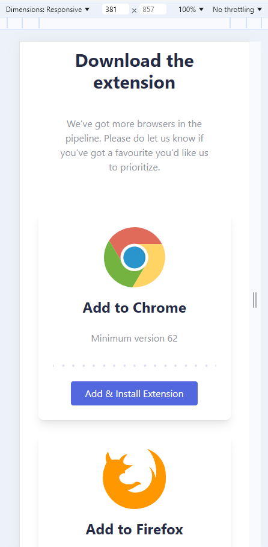

# Bookmark landing page

This project involved making a bookmark landing page that included a mobile and web responsive design. It also included a side navigation bar in mobile, a footer, a newsletter signup, tailwindcss design layout and an faq accordian.

## Table of contents

- [Overview](#overview)
  - [The challenge](#the-challenge)
  - [Screenshots](#screenshots)
  - [Links](#links)
- [My process](#my-process)
  - [Built with](#built-with)
  - [What I learned](#what-i-learned)
  - [Continued development](#continued-development)
  - [Useful resources](#useful-resources)
- [Author](#author)

## Overview

### The challenge

Users should be able to:

- View the optimal layout for the site depending on their device's screen size
- See hover states for all interactive elements on the page
- Receive an error message when the newsletter form is submitted if:
  - The input field is empty
  - The email address is not formatted correctly

### Screenshots

Desktop Version:


Mobile Version:





### Links

- Solution URL: [Add solution URL here](https://your-solution-url.com)
- Live Site URL: [Bookmark Landing Page Laura Dev](https://bookmarklandingpagelauradev.netlify.app/)

## My process

### Built with

- Semantic HTML5 markup
- CSS custom properties
- Flexbox
- CSS Grid
- Mobile-first workflow
- [React](https://reactjs.org/) - JS library

### What I learned

Things I learned:

1. Validating Email - I learned that you created a function called validateEmail that takes one parameter email. From there, one would use a regular expression pattern that assigns the variable re to validate the structure of an email address. Ater the regex pattern then convert the email to a string and convert it to lowercase using the fucntion. It tests the lowercase email string against the regex pattern re using the test method. The test method returns true is the femail matches the pattern otherwise it is false.

```^ asserts the start of the string.
[^\s@]+ matches one or more characters that are not whitespace (\s) or @.
@ matches the @ symbol.
[^\s@]+ matches one or more characters that are not whitespace or @ (the part after the @).
\. matches a literal dot (.).
[^\s@]+ matches one or more characters that are not whitespace or @ (the domain part).
$ asserts the end of the string.``

2. Setting the email section signup for the newsletter - The form element attaches the handleSubmit function to handle the form submission. The input element specifices the input is for email address, bind the input value to the email state, onChange updates the email state when the input value changes with tailwindcss designlayout. The error message is conditionally render if the rror state is truthy. The submit button specifies that the button submits the form. 

### Continued development

### Useful resources

- [SVG Creator](https://www.softr.io/tools/svg-shape-generator) - I created the blue half circle with this website.
- [Half Ellipse Shape Inspiration](https://github.com/Abbassher55/bookmark-project/blob/main/src/hero-section/Hero.jsx) - Inspiration for the half ellipse shape on the page.

## Author

- Website - [Laura V](www.lauradeveloper.com)
- Frontend Mentor - [@lavollmer](https://www.frontendmentor.io/profile/yourusername)
- Github - [@lavollmer](https://github.com/lavollmer)
```
